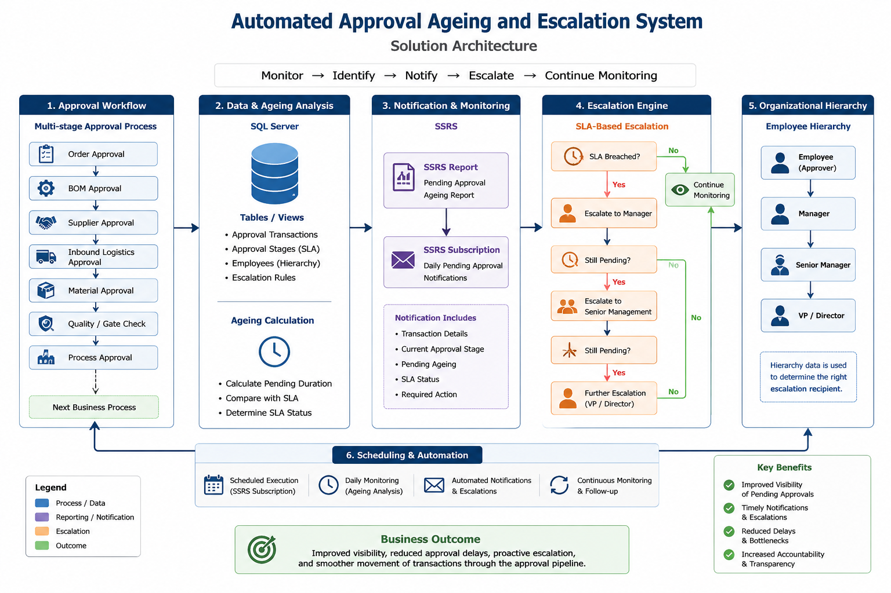

# Automated Approval Ageing and Escalation System

## Overview

This project demonstrates an automated approach for monitoring approval ageing and escalating delayed approvals in a multi-stage business workflow.

In many business processes, a transaction must pass through several sequential approval stages before downstream activities can begin. A delay at any one stage can create a bottleneck and prevent the entire process from moving forward.

This solution uses **SQL Server and SSRS** to:

- Monitor pending approvals
- Calculate approval ageing
- Identify the responsible approver
- Send scheduled approval reminders
- Escalate delayed approvals based on defined SLA thresholds
- Route escalations through the organizational hierarchy
- Improve visibility and accountability across the approval pipeline

The solution follows an exception-based workflow:

**Monitor → Identify → Notify → Escalate → Continue Monitoring**

---

## The Business Problem

The original process involved multiple dependent approval stages.

A simplified workflow:

```text
Order Approval
      ↓
BOM Approval
      ↓
Supplier Approval
      ↓
Inbound Logistics Approval
      ↓
Material Approval
      ↓
Quality / Gate Check
      ↓
Process Approval
      ↓
Next Business Process
```

The next stage could not begin until the current approval was completed.

This meant that a single delayed approval could create a bottleneck for the entire downstream process.

The manual monitoring process required users to:

- Check the system for pending approvals
- Identify the current approval stage
- Identify the responsible approver
- Check how long the approval had been pending
- Follow up manually
- Identify the appropriate manager
- Escalate unresolved approvals
- Repeat the process

The challenge was not making the approval decision itself.

The challenge was ensuring that delayed approvals did not remain unnoticed.

---
## Solution Architecture


## The Solution

The process was transformed into an automated monitoring and escalation workflow.

```text
Monitor Approval Pipeline
          ↓
Identify Pending Approval
          ↓
Calculate Approval Ageing
          ↓
Notify Responsible User
          ↓
SLA Breached?
     │              │
    No             Yes
     │              │
     ▼              ▼
Monitor      Escalate Automatically
                    │
                    ▼
                 Manager
                    │
                    ▼
              Still Pending?
                 │        │
                No       Yes
                 │        │
                 ▼        ▼
             Continue   Further Escalation
                            │
                            ▼
                        VP / Director
```

The automation provides visibility of delayed tasks while allowing the actual approval decisions to remain with the responsible business users.

---

## Key Features

- ⏳ Automated approval ageing analysis
- 🔍 Identification of pending approval stages
- 👤 Responsible approver identification
- 📧 Scheduled reminder notifications
- 🚨 SLA-based escalation
- 👔 Manager-level escalation
- 🏢 Senior management escalation
- 📊 Centralized approval pipeline visibility
- 🔄 Exception-based monitoring
- ⚙️ SQL Server and SSRS-based automation

---

## Technology Stack

| Component | Technology |
|---|---|
| Approval workflow data | SQL Server Tables / Views |
| Ageing calculation | SQL Server |
| Approval analysis | SQL Queries |
| Reporting | SSRS |
| Notifications | SSRS Subscriptions |
| Escalation | SQL Logic + SSRS |
| Scheduled delivery | SSRS Subscriptions |
| Organizational hierarchy | SQL Server Views / Tables |

---

## Repository Structure

```text
automated-approval-ageing-and-escalation/
│
├── README.md
│
├── docs/
│   ├── architecture.md
│   └── lean-impact.md
│
├── sql/
│   ├── 01-approval-ageing-analysis.sql
│   ├── 02-escalation-level-identification.sql
│   └── 03-multi-level-escalation-example.sql
│
└── images/
```

---

## SQL Examples

The SQL examples in this repository demonstrate the technical approach using a fictional and sanitized schema.

### 1. Approval Ageing Analysis

```text
Pending Approval
        ↓
Calculate Pending Duration
        ↓
Compare Against SLA
        ↓
Within SLA / SLA Breached
```

Example file:

`sql/01-approval-ageing-analysis.sql`

---

### 2. Escalation Identification

```text
SLA Breached
      ↓
Identify Current Approver
      ↓
Identify Manager
      ↓
Determine Escalation Action
```

Example file:

`sql/02-escalation-level-identification.sql`

---

### 3. Multi-Level Escalation

```text
Within SLA
    ↓
Reminder
    ↓
Manager Escalation
    ↓
Senior Management Escalation
```

Example file:

`sql/03-multi-level-escalation-example.sql`

---

## Architecture

The complete solution architecture is documented here:

[`docs/architecture.md`](docs/architecture.md)

The architecture covers:

- Approval workflow monitoring
- Ageing analysis
- Notification flow
- SLA-based escalation
- Organizational hierarchy
- SSRS-based automation
- End-to-end process flow

---

## Lean and Business Impact

The project was designed using an exception-management approach.

Instead of requiring people to continuously monitor the system:

> **Monitor everything automatically → Focus human attention on delayed exceptions**

The solution helps reduce:

- Waiting caused by delayed approvals
- Repetitive manual monitoring
- Manual follow-up activity
- Delayed escalation
- Hidden process bottlenecks
- Dependency on individual monitoring

The detailed Lean perspective is available here:

[`docs/lean-impact.md`](docs/lean-impact.md)

---

## Reported Business Outcome

The solution improved:

- Visibility of pending approvals
- Accountability for delayed actions
- Escalation of overdue tasks
- Transparency across the approval workflow

The client reported a broader year-on-year business impact of approximately **₹30 lakh** following the implementation period.

This figure may have been influenced by multiple operational and business factors and is **not presented as savings attributable solely to this automation**.

---

## Key Design Principle

> **Automation should not automate waste.**

The goal is not to automate human approval decisions.

The goal is to automate:

- Monitoring
- Visibility
- Follow-up
- Ageing analysis
- Notification
- Escalation

This allows human effort to focus on the decisions and exceptions that genuinely require attention.

---

## Before vs After

### Before

```text
Check System
     ↓
Identify Pending Approval
     ↓
Identify Responsible User
     ↓
Check Ageing
     ↓
Manual Follow-Up
     ↓
Wait
     ↓
Check Again
     ↓
Manual Escalation
     ↓
Repeat
```

### After

```text
Automated Monitoring
        ↓
Approval Ageing Analysis
        ↓
User Notification
        ↓
SLA-Based Escalation
        ↓
Management Escalation
        ↓
Continue Monitoring
```

---

## Confidentiality Notice

This repository documents the **technical design and automation pattern** using fictional examples.

To protect confidential business information:

- No internal company table names are included
- No proprietary SQL queries are included
- No internal business data is included
- No real employee or customer information is included
- SQL examples use a fictional schema

The repository is intended to demonstrate the technical and process-improvement approach without exposing proprietary implementation details.

---

## Conclusion

This project demonstrates how **SQL Server and SSRS can be used beyond traditional reporting** to create a lightweight approval monitoring and escalation framework.

The overall transformation is:

```text
Manual Monitoring
       ↓
Automated Visibility
       ↓
Proactive Notification
       ↓
SLA-Based Escalation
       ↓
Exception-Based Management
```

The objective is simple:

**Make pending approvals visible, ensure delayed actions receive attention, and prevent bottlenecks from remaining hidden.**
